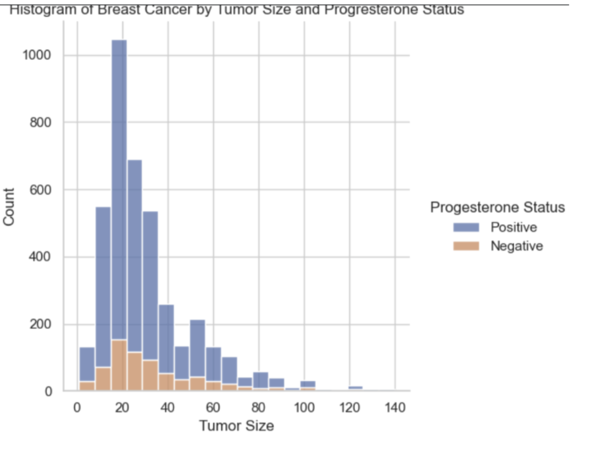
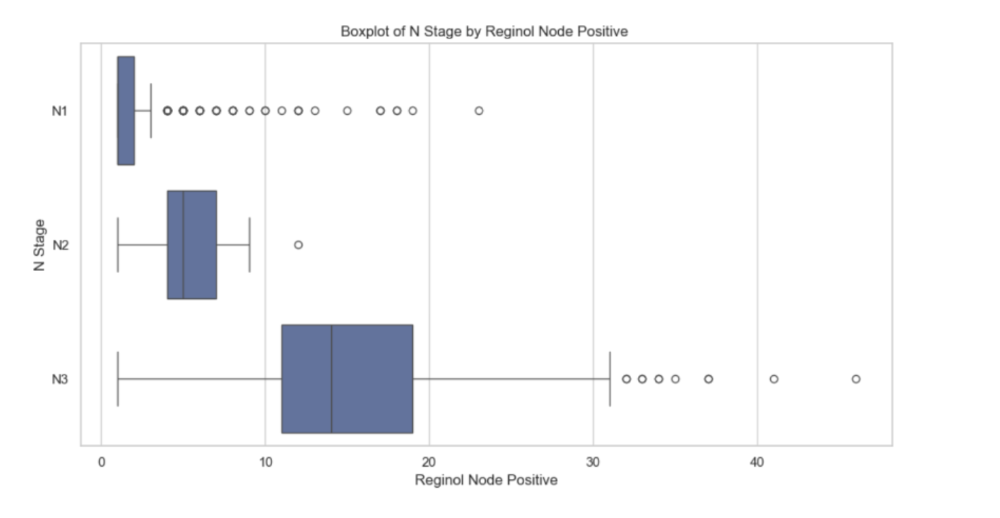
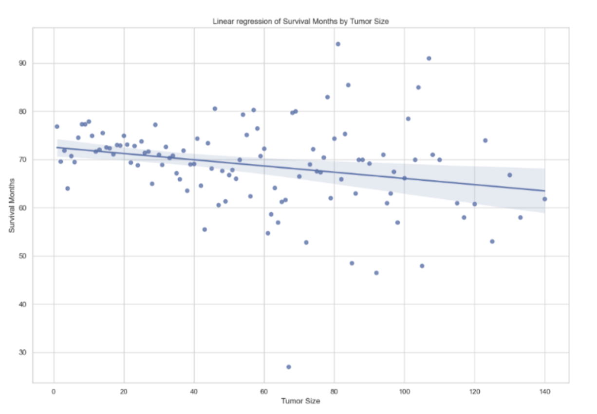
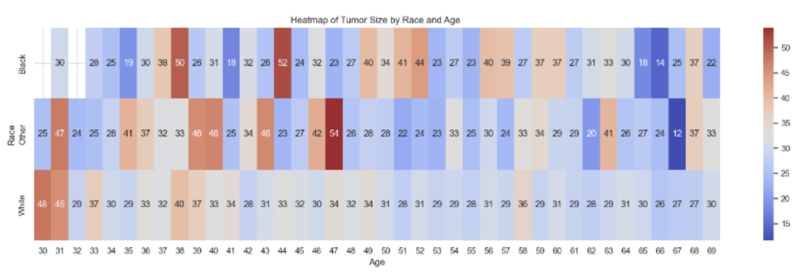
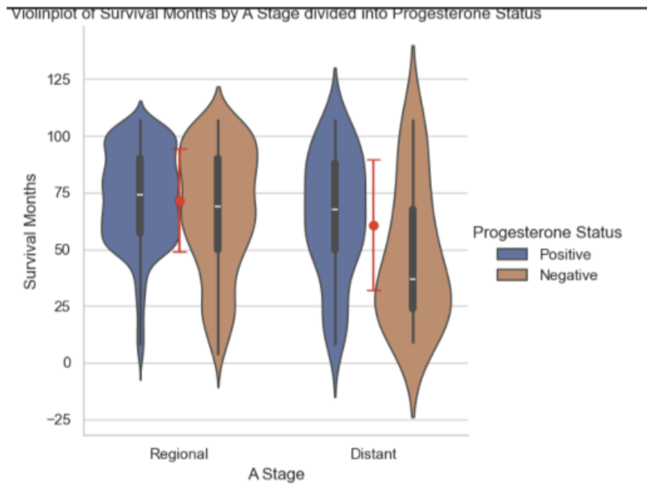

# Breast Cancer Data Analysis

This project focuses on analyzing breast cancer data through various statistics and visualizations. I explore key patterns and distributions in the dataset to gain insights into breast cancer characteristics.

## Dataset
This dataset on breast cancer patients originates from the 2017 SEER Program, conducted by the National Cancer Institute (NCI), which provides information on cancer statistics within the population. The dataset includes women diagnosed with ductal and lobular breast cancer between 2006 and 2010. A total of 4,024 patients were included in the analysis.
The selected dataset contains 4,024 records and 16 features, including 5 numerical features and 11 categorical features

Download dataset: 
IEEE Dataport: https://ieee-dataport.org/open-access/seer-breast-cancer-data
Kaggle: https://www.kaggle.com/datasets/sujithmandala/seer-breast-cancer-data/data

## Features of the Project

# 1. Data Exploration and Statistical Analysis
- Descriptive statistics for numerical and categorical variables
- Analysis of distributions, skewness, and variability
- Identification of class imbalance
- Detection of relationships between features
# 2. Data Visualization
Multiple visualization techniques were used to better understand relationships between features:
- Histograms and boxplots to analyze distributions
|  |  
|   |   |
- Linear regression plots
|  |
- Heatmaps to explore correlations
|  |
- Violin plots for category-based comparisons
|   |
- t-SNE plots for dimensionality reduction and cluster visualization
|   |

These visualizations helped identify:
- Potential linear relationships 
- Class imbalance in categorical variables
- Overlapping feature distributions that could affect model performance

# Prediction Modeling
# 3.1 Regression Model - Tumor Size Prediction
Models applied:
- Linear Regression
- Gradient Boosting Regressor
- Random Forest Regressor
- Support Vector Regressor
Techniques used:
- Feature scaling (StandardScaler, MinMaxScaler)
- Categorical encoding (OneHotEncoder, OrdinalEncoder)
- Regularization (Ridge, Lasso)
- Polynomial feature expansion
- Hyperparameter tuning
- Custom Gradient Descent implementation
- Ensemble methods: Voting Regressor, Stacking, Mixed of Experts
Evaluation metrics:
- R²
- MAE
- MSE
# 3.2 Classification Model - 6th Stage Prediction
Algorithms used:
- Logistic Regression
- Random Forest
- Extra Trees
- Support Vector Classifier
Applied methods:
- Cross-validation
- Hyperparameter optimization
- Ensemble learning
Metrics used:
- Accuracy
- Precision
- Recall
- F1-score
# 3.3 Classification Model -  Survival Status Prediction
Prediction of Alive/Dead status
Handling class imbalance using:
- SMOTE oversampling
- Undersampling
- Performance comparison before and after balancing

# 4. Model Evaluation and Validation
- Performed k-fold cross-validation to ensure model stability.
- Analyzed learning curves and convergence plots.
- Investigated overfitting and underfitting using: polynomial feature expansion, regularization methods
- Compared model performance before and after:regularization, hyperparameter tuning, ensemble learning, data balancing

# 5. Key Conclusions
The dataset is complete but contains highly imbalanced categorical features, requiring balancing techniques.
Tumor Size prediction benefits from regression ensembles and regularization.
6th Stage classification achieved very high accuracy after hyperparameter tuning and ensemble modeling.
Survival Status classification required balancing methods to improve detection of minority class cases.
Visualizations and statistical analysis were crucial for understanding feature relationships and guiding model selection.

## Technologies Used
The project was implemented using:
- Python 3.x
- pandas - data manipulation
- numpy - numerical computations
- scikit-learn - machine learning models
- matplotlib - data visualization
- seaborn - advanced visualizations


## Features

- Data Processing – Cleaning and preprocessing breast cancer dataset.

- Statistical Analysis – Computing basic statistical summaries.

- Visualization – Generating various types of plots to explore data trends.

- Saving outcomes of the analysis into one file

Install my project 

## Installation

1. Clone the repository
```bash
  git clone <repository_url>
  cd <repository_folder>
```
2. Create a virtual environment (optional but recommended)
```bash
python -m venv venv
source venv/bin/activate      # Linux / Mac
venv\Scripts\activate         # Windows
```
3. Install required packages
All necessary libraries are listed in the provided requirements.txt file.
```bash
pip install -r requirements.txt
```

## Report

Full analysis reports in PDF and pptx format are available here:

- [Report I (pptx)](reports/Report-PartI.pdf)
- [Report II (pdf)](reports/Report-PartII.pdf)
- [Report III (pdf)](reports/Report-PartIII.pdf)
## Project structure
Breat-Cancer-Data-Analysis/
│
├── advanced-statistics/
│   └── 6thStage/
│   └── status/
│   └── tumorSize/
│ 
├── basic-statistics/
│
├── images/
│
├── reports/
│
├── visualisations/
│
├── main.py
├── requirements.txt
└── README.md

## Author
Róża Mazurek

